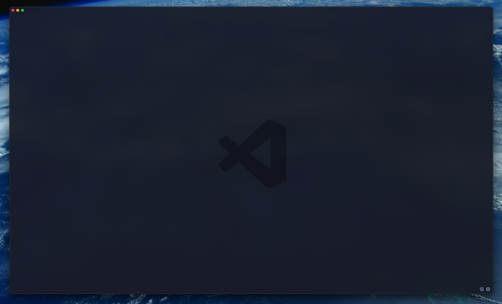
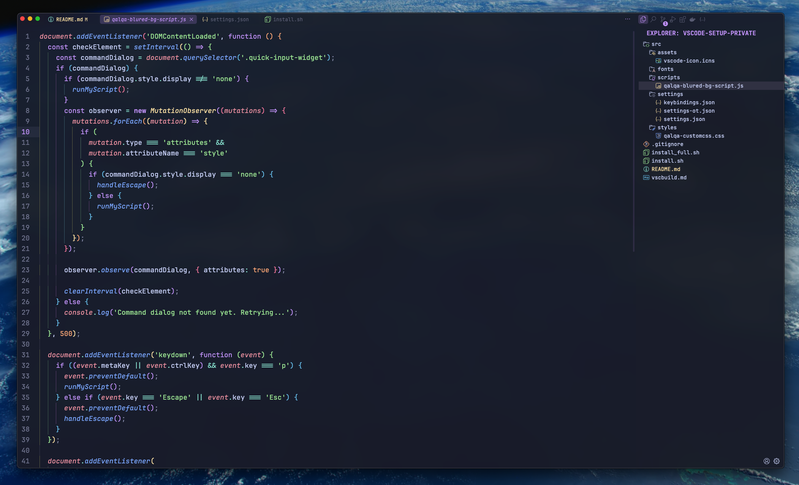
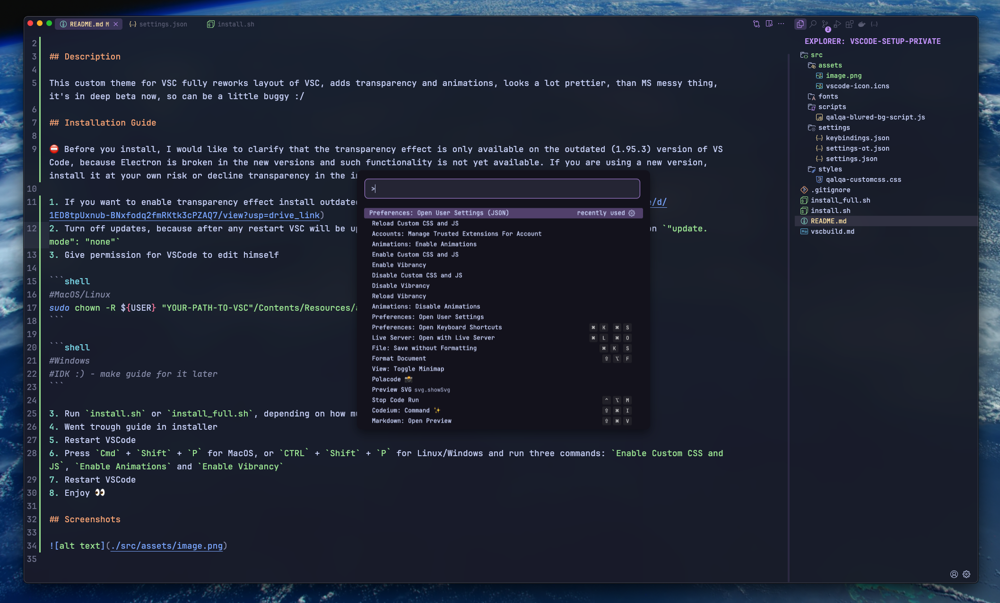
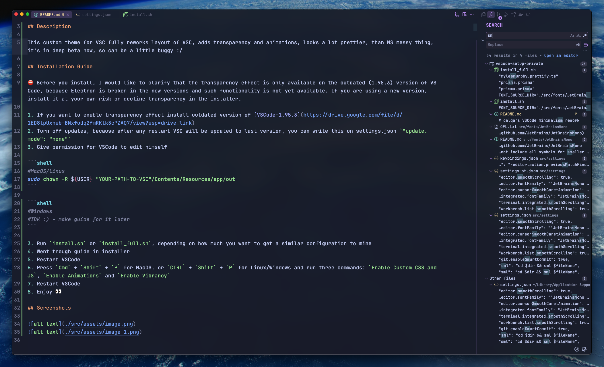
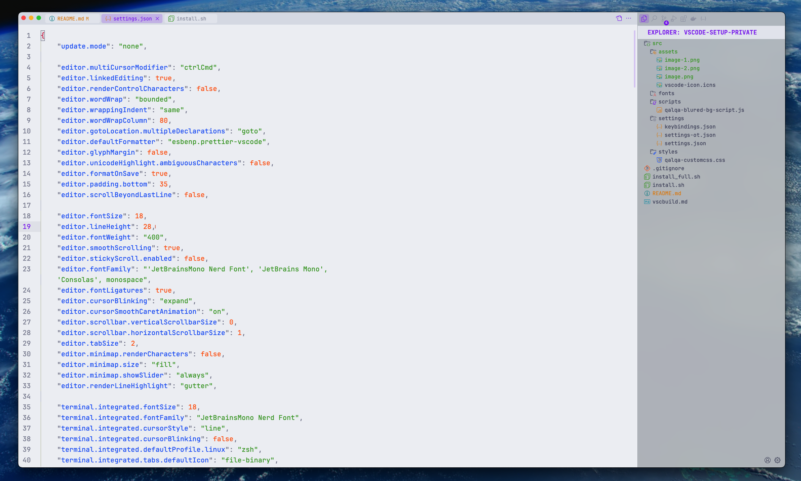

# qalqa's VSCode minimalism rework

## Description

This custom theme for VSC fully reworks layout of VSC, adds transparency and animations, looks a lot prettier, than MS messy thing, it's in deep beta now, so can be a little buggy :/

## Installation Guide

⛔️ Before you install, I would like to clarify that the transparency effect is only available on the outdated (1.95.3) version of VS Code, because Electron is broken in the new versions and such functionality is not yet available. If you are using a new version, install it at your own risk or decline transparency in the installer.

1. If you want to enable transparency effect install outdated version of [VSCode-1.95.3](https://drive.google.com/file/d/1ED8tpUxnub-BNxfodq2fmRKtk3cPZAQ7/view?usp=drive_link)
2. Turn off updates, because after any restart VSC will be updated to last version, you can write this on settings.json `"update.mode": "none"`
3. Give permission for VSCode to edit himself

```shell
#MacOS/Linux
sudo chown -R ${USER} "YOUR-PATH-TO-VSC"/Contents/Resources/app/out
```

```shell
#Windows
#IDK :) - make guide for it later
```

3. Run `install.sh` or `install_full.sh`, depending on how much you want to get a similar configuration to mine
4. Went trough guide in installer
5. Restart VSCode
6. Press `Cmd` + `Shift` + `P` for MacOS, or `CTRL` + `Shift` + `P` for Linux/Windows and run three commands: `Enable Custom CSS and JS`, `Enable Animations` and `Enable Vibrancy`
7. Restart VSCode
8. Enjoy 👀

## Screenshots

### Empty



### Main



### Quick menu



### Search



### Btw light still in development



## Used extensions

1.  [Vibrancy Continued](https://marketplace.visualstudio.com/items?itemName=illixion.vscode-vibrancy-continued)
2.  [Catppuccin Theme](https://marketplace.visualstudio.com/items?itemName=Catppuccin.catppuccin-vsc)
3.  [Catppuccin Icons](https://marketplace.visualstudio.com/items?itemName=Catppuccin.catppuccin-vsc-icons)
4.  [VSCode Animations](https://marketplace.visualstudio.com/items?itemName=BrandonKirbyson.vscode-animations)
5.  [Custom Css and JS](https://marketplace.visualstudio.com/items?itemName=be5invis.vscode-custom-css)
